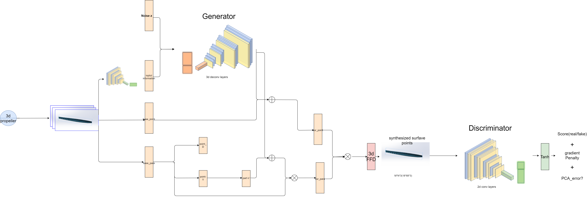

## MS-GAN

A compact, fully covered parametric design space is required to reduce the computational costs associated with aerodynamic shape optimization. Recent research in deep generative modeling has focused on two-dimensional (2D) aerodynamic airfoils, which significantly increases the realism and capability of the generative space. However, little attention has been paid to three-dimensional aerodynamic/hydrodynamic shapes. Traditional parametric methods can only partially reduce the design parameters and cannot improve the generative capability. In this study, the FFD-PCA method is proposed, which extends the free deformation approach by incorporating principal component analysis to improve the sensitivity to surface shape changes while keeping the shape smooth. In addition, a generative MS-GAN model equipped with FFD-PCA was developed and designed for use in multi-species to integrate shape information from different species to efficiently generate different types of 3D surface shapes for multip-species. Two experiments were conducted to generate a 3D control surface point cloud and dozens of different types of 3D propeller blade point clouds. MS-GAN was found to outperform FFD-based GAN in terms of smoothness and realism, and to be significantly less unmodelable (38.55%) compared to FFD-GAN.

the architecture of model is shown as follows:

# Reference

The FFD section is referenced from Wei Chen
